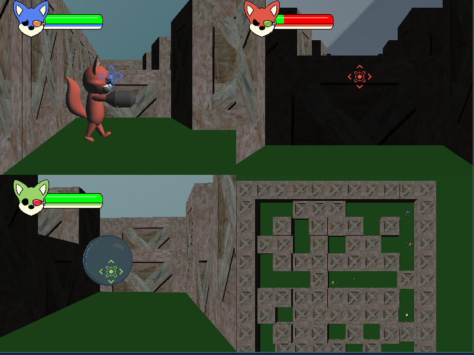

# Fox Trail

Rapid game development prototype, Multiplayer FPS 3D game written on python with Panda3D

## Dependencies

 - python 2.7 (https://www.python.org/downloads/)
 - Panda3D (https://www.panda3d.org/download.php)
 - pygame (pip install pygame)
 
 ## Warning
 
 - It needs 3 controllers in order to be playable, a fix will come soon, this is was not the final version, I will add it when I have some time.
 - The controller can be Xbox 360, Xbox One or PS 3
